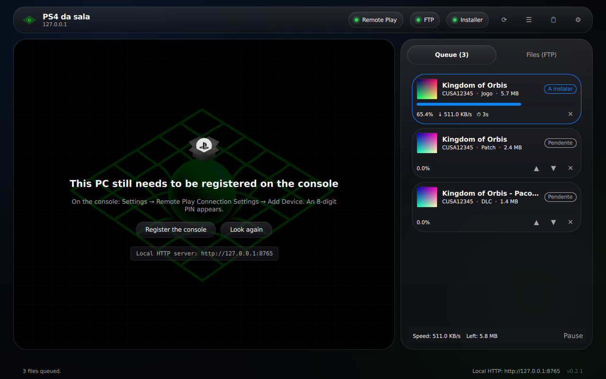
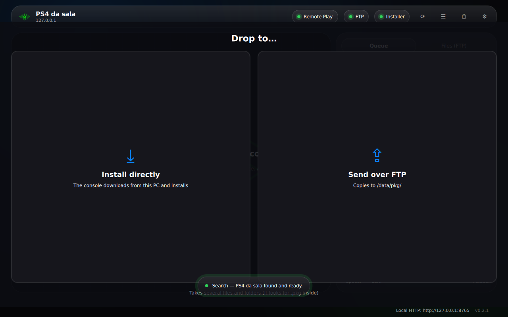
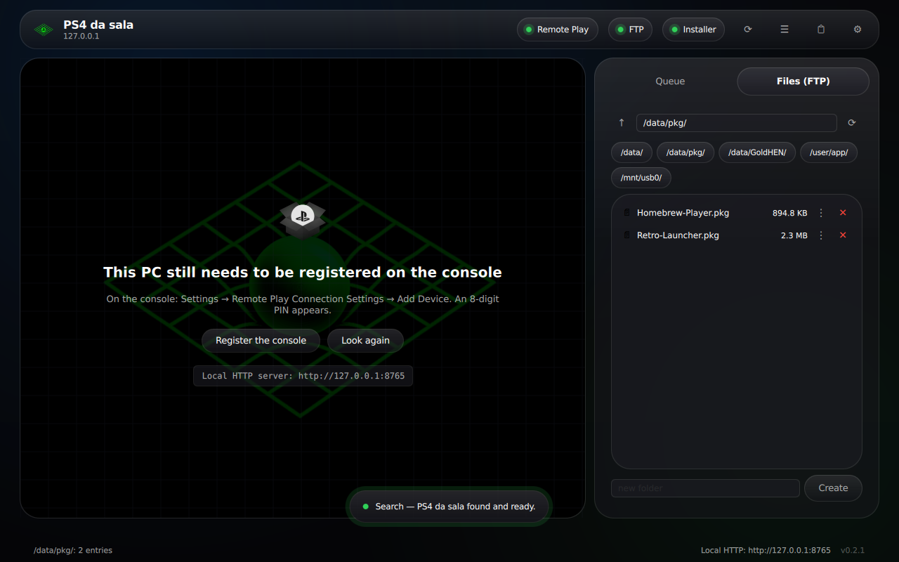
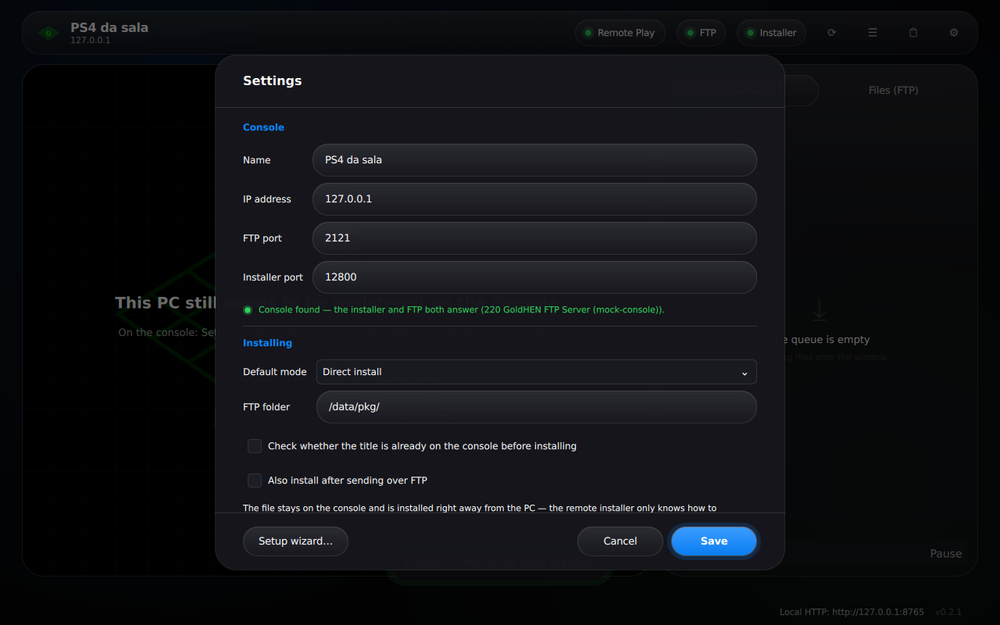
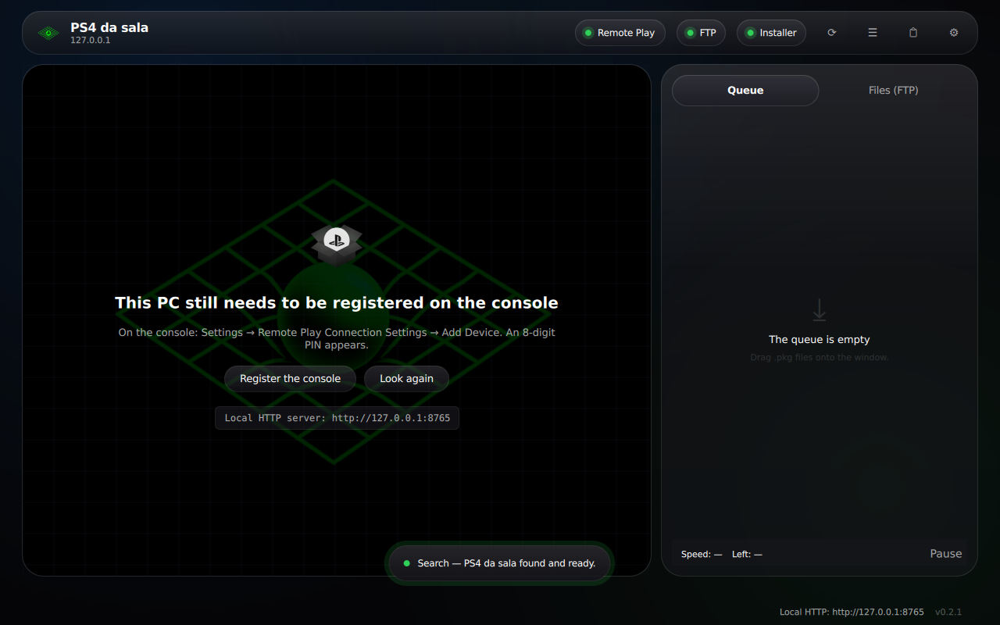
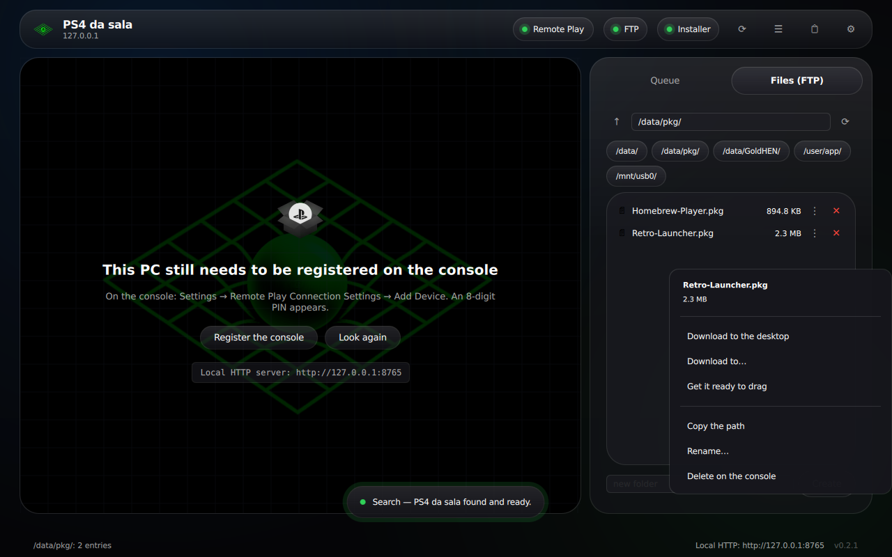

# OrbisLink

Criei esta repo com o objetivo de facilitar a utilização de uma PS4 desbloqueada, uma mistura do RemotePlay e do FileZilla, um agradecimento a todos que disponibilizaram o código na internet, graças a vocês é que esta repo existe, agradecimento especial ao CHIAKI e a todos os devs que ajudaram a criar o desbloqueio, a app foi construída INTEIRAMENTE pelo CLAUDE na versão PRO, usem, modifiquem e divirtam-se :p .

Aplicação de desktop que junta numa só janela o **Remote Play** de uma PS4
com GoldHEN, a **instalação de ficheiros .pkg por arrastar e largar** e um
**cliente FTP** para a consola.

> **Estado:** núcleo, fila, testes, **interface gráfica**, empacotamento
> para Windows e Linux e **Remote Play** (descoberta, registo, acordar a
> consola, vídeo, som e teclado como comando).
> Falta o comando por USB/Bluetooth, a descodificação por hardware e as
> traduções. Ver [O que falta](#o-que-falta-e-porquê).

## A interface



*Instalação direta a decorrer: o PC serve o pkg, a consola descarrega por
pedidos `Range` e instala. Jogo → patch → DLC entram na ordem certa
automaticamente.*

| Arrastar e largar | Explorador de FTP | Definições |
|---|---|---|
|  |  |  |



*A área central passou a ser o Remote Play: diz em que estado está a
consola e o que falta fazer a seguir — registar, acordar ou ligar.*



*No explorador de FTP, cada ficheiro e cada pasta tem o seu menu: transferir
para o PC, preparar para arrastar para fora da janela, copiar o caminho,
mudar o nome, apagar na consola. Nas definições, o endereço IP é verificado
sozinho à medida que se escreve.*

Todas estas capturas são geradas automaticamente por
`./scripts/screenshots.sh`, contra a consola falsa — o que lá está é o
comportamento real, não maquetas.

## Âmbito de uso

Destina-se a consolas do próprio utilizador, para homebrew e cópias de
jogos que o utilizador possui legalmente. **A aplicação não inclui, não
descarrega, não indexa nem sugere fontes de conteúdo**, e não executa
jailbreak nem carrega payloads: a consola tem de já ter o GoldHEN a correr.

## Requisitos na consola

| Serviço | Porta | Como ativar |
|---|---|---|
| Servidor FTP do GoldHEN | 2121 | vem com o GoldHEN, ativo por omissão |
| Remote Package Installer (flatz) | 12800 | instalar e **deixar a app aberta e em primeiro plano** enquanto envia comandos |
| Remote Play | 987/UDP, 9295/TCP, 9296–9297/UDP | ativar nas definições da consola e registar |

## Descarregar (já compilado)

Os binários são produzidos pelo GitHub Actions
([workflow "Release"](.github/workflows/release.yml)):

* **Windows x64** — `OrbisLink-<versão>-setup.exe` (instalador) ou
  `OrbisLink-<versão>-windows-x64.zip` (portátil). O executável é autónomo:
  não precisa de DLLs, do Visual C++ Redistributable nem de nada instalado.
* **Linux x86-64** — `orbislink-<versão>-linux-x86_64.tar.gz`.

Há dois tipos de lançamento:

* **Estável** — `vX.Y.Z`, publicado de propósito a partir do `main` (uma
  tag `v*`, ou **Actions → Release → Run workflow** com o ramo `main`).
  É o que a página do repositório mostra como a última versão.
* **Testes** — `vX.Y.Z-dev.N`, publicado sozinho em **cada push** para o
  ramo `beta`, como pré-lançamento (ou à mão, com **Run workflow** e o
  campo da versão vazio). Ficam só os cinco mais recentes.

Os ramos são dois: `main` é o oficial, e é dele que saem as versões
estáveis; `beta` é onde as mudanças entram primeiro, e passam para `main`
quando estiverem testadas.

A aplicação actualiza-se a partir daqui: em **Definições → Actualizações**,
o canal **Estável** só vê as versões finais; o canal **Testes (builds da
branch)** vê também cada compilação de testes, e instala-a num clique
(com o SHA-256 confirmado antes de correr o instalador).

O instalador de Windows coloca o programa em `C:\Program Files\OrbisLink`,
cria atalhos no Menu Iniciar, regista o desinstalador e — se deixares a
opção ativa — **cria a regra de firewall** que permite à consola descarregar
os pkg do PC (sem ela a instalação fica em 0 bytes).

## Compilar

Dependências: CMake ≥ 3.16, um compilador C++17 (GCC, Clang ou MSVC) e
libcurl.

```bash
# Debian/Ubuntu
sudo apt install cmake build-essential libcurl4-openssl-dev

cmake -S . -B build -DCMAKE_BUILD_TYPE=RelWithDebInfo
cmake --build build
ctest --test-dir build --output-on-failure
```

No Windows, com o vcpkg:

```powershell
cmake -S . -B build -DCMAKE_TOOLCHAIN_FILE=<vcpkg>/scripts/buildsystems/vcpkg.cmake
cmake --build build --config RelWithDebInfo
```

### Gerar os pacotes

```bash
./scripts/build-linux.sh      # compila, corre os testes e faz o .tar.gz

sudo apt install mingw-w64 nsis zip
./scripts/build-windows.sh    # .exe autónomo + .zip portátil + instalador
```

`build-windows.sh` compila a partir de Linux, com mingw-w64: compila um
libcurl estático (TLS pelo Schannel do Windows, sem OpenSSL) e liga tudo
estaticamente. É o mesmo caminho que o CI usa, por isso o que sai aqui é
igual ao que sai lá.

## Experimentar sem PS4

A pasta `tools/mock-console/` traz uma consola falsa: servidor FTP anónimo
e a API do instalador na 12800, que descarrega mesmo os pkg do servidor
HTTP local com pedidos `Range`, tal como a consola faz.

```bash
# terminal 1
python3 tools/mock-console/mock_console.py --ftp-port 2121 --api-port 12800

# terminal 2
python3 tools/mock-console/make_test_pkg.py /tmp/jogo.pkg --padding 4000000
./build/orbislink-cli inspect /tmp/jogo.pkg
./build/orbislink-cli services --host 127.0.0.1
./build/orbislink-cli install --host 127.0.0.1 --bind 127.0.0.1 /tmp/jogo.pkg
./build/orbislink-cli ftp-ls --host 127.0.0.1 /data/pkg
```

O mesmo percurso corre automaticamente em
`ctest -R integration_mock_console`.

## Com uma PS4 a sério

```bash
./build/orbislink-cli services --host 192.168.1.42
./build/orbislink-cli install  --host 192.168.1.42 "/caminho/Jogo.pkg" "/caminho/Patch.pkg"
./build/orbislink-cli ftp-put  --host 192.168.1.42 "/caminho/Jogo.pkg" /data/pkg/Jogo.pkg
```

O servidor HTTP local liga-se por omissão à interface cuja sub-rede contém
o IP da consola e só aceita pedidos desse IP. Na primeira utilização em
Windows, a Firewall vai pedir autorização — é preciso concedê-la, senão a
consola não consegue descarregar do PC.

`orbislink-cli --help` lista todos os comandos.

## Estrutura

```
src/orbislink/
  common/     JSON tolerante, log rotativo, utilidades
  net/        sockets, cliente HTTP (libcurl), escolha de interface local
  pkg/        PkgInspector, parser de PARAM.SFO
  http/       LocalHttpServer (Range/206, tokens, restrição por IP)
  installer/  IInstallerBackend, RpiClient, tradução de códigos de erro
  ftp/        FtpClient (libcurl)
  queue/      InstallQueue com persistência
  settings/   SettingsStore
  console/    ConsoleManager (verificação de serviços)
tools/cli/            orbislink-cli
tools/mock-console/   consola falsa + gerador de pkg de teste
tests/                testes unitários e de integração
docs/                 especificação corrigida, validação, erros, arquitetura
packaging/windows/    script do instalador (NSIS) e o LEIA-ME que vai dentro
scripts/              build-linux.sh, build-windows.sh
cmake/                toolchain de cross-compilação para mingw-w64
```

## Documentação

* [`docs/especificacao.md`](docs/especificacao.md) — especificação com os
  pontos **[VALIDAR]** já resolvidos.
* [`docs/validacao.md`](docs/validacao.md) — o que foi confirmado, onde, e
  em que difere da especificação original.
* [`docs/error_codes.md`](docs/error_codes.md) — códigos de erro
  traduzidos e os que ainda não têm fonte.
* [`docs/arquitetura.md`](docs/arquitetura.md) — módulos, threads e fluxos.

## Se alguma coisa não funcionar

**O arrastar e largar não faz nada e o cursor mostra o sinal de proibido.**
A aplicação está a correr como administrador. O Windows não deixa arrastar
ficheiros do Explorador — que corre sem privilégios elevados — para uma
janela que os tem, e bloqueia as mensagens sem avisar ninguém. Fecha e abre
pelo atalho normal; o OrbisLink não precisa de privilégios para nada. (Até
à 0.2.1, carregar em "Abrir o OrbisLink" no fim da instalação deixava-o
elevado, porque o instalador precisa de o ser para criar a regra de
firewall.)

**O Remote Play liga mas não sai som.** Exporta o diagnóstico (Ctrl+L →
"Guardar relatório"). A secção *Remote Play — caminho do som* mostra os
nove troços entre o descodificador e a placa, com os contadores, e diz em
qual deles o caudal chega a zero.

**Escolhi 1080p e a imagem não mudou.** Só a PS4 Pro e a PS5 fazem 1080p em
Remote Play. Numa PS4 normal a própria consola baixa o pedido para 720p — a
aplicação avisa quando isso acontece, e a barra do stream mostra o tamanho
real da imagem e os fps contados.

**A janela não abre de todo.** Ver `SE A JANELA NAO ABRIR` no `LEIA-ME.txt`
que vem no instalador: em máquinas sem aceleração gráfica, o arranque
seguinte passa sozinho a desenho por software.

Em qualquer caso, o diagnóstico (Ctrl+L) é o que diz o que se passou. Não
leva o Account ID nem as chaves de registo — só os tamanhos delas.

## O que falta, e porquê

A lista completa e verificada contra o código está em
[`docs/estado.md`](docs/estado.md) — é o sítio onde se vê, item a item, o
que está feito, o que falta confirmar numa consola real e o que ainda não
existe. O resumo:

**Remote Play pela PSN.** Só rede local. Ligar de fora exige a
infra-estrutura de *holepunch* da Sony, que o chiaki-ng suporta mas obriga
a uma conta e a um caminho de autenticação que este projecto ainda não tem.

**1080p só em PS4 Pro e PS5.** Não é uma limitação daqui: uma PS4 normal não
faz 1080p em Remote Play, e é a própria consola que baixa o pedido para
720p. A aplicação avisa quando isso acontece.

**Desfoque verdadeiro por trás do vidro.** A linguagem visual é conseguida
por camadas translúcidas sobrepostas. Um desfoque a sério do que está por
trás precisa do `QtQuick.Effects` (Qt 6.5+), e isto compila com 6.4 na
máquina onde as capturas são geradas. Sobre o fundo desta aplicação — um
gradiente com halos — a diferença quase não se vê; fica registado como
pendente e não como feito.

**Janela inteira com o material do sistema.** No Windows 11 a barra de
título já usa o acrílico ou o mica do sistema. Estender isso ao conteúdo
obriga a pintar a janela transparente, o que numa máquina em desenho por
software pode sair preto — e isso não foi possível verificar.

**AppImage para Linux.** Há o `.tar.gz` com a linha de comandos; a interface
gráfica é distribuída só para Windows.

**Assinatura do executável.** O instalador não é assinado, portanto o
Windows mostra o aviso do SmartScreen na primeira execução. Um certificado
de assinatura de código custa algumas centenas de euros por ano, e para um
projecto que não se vende não se justifica. É uma decisão, não uma dívida.

### Checklist de testes manuais numa PS4 real

- [ ] Descoberta e registo do Remote Play
- [ ] Stream estável durante um upload FTP de 10 GB+
- [ ] Instalação direta de homebrew pequeno
- [ ] Instalação direta de pkg > 4 GB
- [ ] Jogo + patch + DLC largados juntos (ordem gd → gp → ac)
- [ ] Queda de rede a meio e retoma
- [ ] Firewall do Windows a bloquear → mensagem correta
- [ ] Retoma de upload FTP com `REST`/`APPE` (por confirmar, ver `docs/validacao.md` §9)

## Licença

**AGPL-3.0-or-later** (ver [`LICENSE`](LICENSE)).

    Copyright (C) 2026 os autores do OrbisLink

O Remote Play vem do chiaki-ng, que é AGPL-3.0, e essa licença é
contagiosa: se a aplicação for distribuída, o código-fonte tem de o ser
também. É por isso que este repositório existe.

Os avisos de copyright do chiaki-ng e das outras bibliotecas ficam onde
estão — são de outras pessoas e a licença obriga a preservá-los.

Créditos das fontes consultadas para a implementação do protocolo:
[chiaki-ng](https://github.com/streetpea/chiaki-ng),
[Remote Package Installer](https://github.com/flatz/ps4_remote_pkg_installer),
[GoldHEN](https://github.com/GoldHEN/GoldHEN) e o
[OpenOrbis PS4 Toolchain](https://github.com/OpenOrbis/OpenOrbis-PS4-Toolchain).
