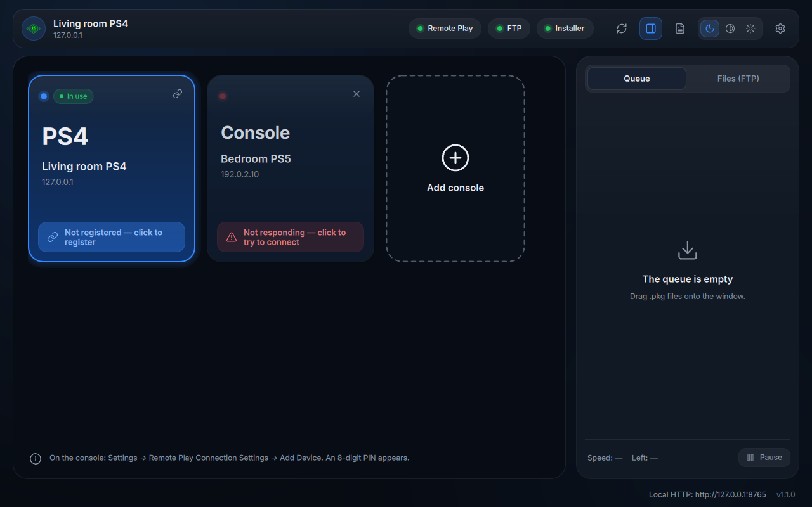
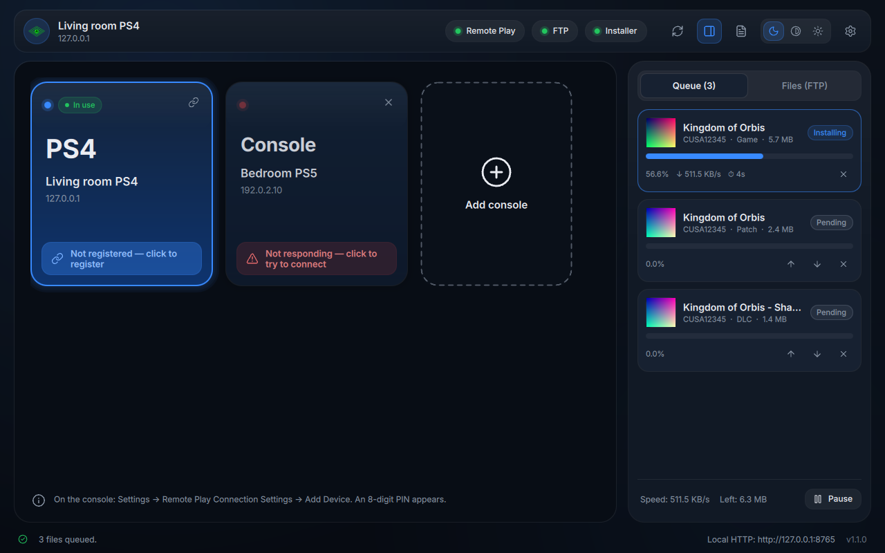
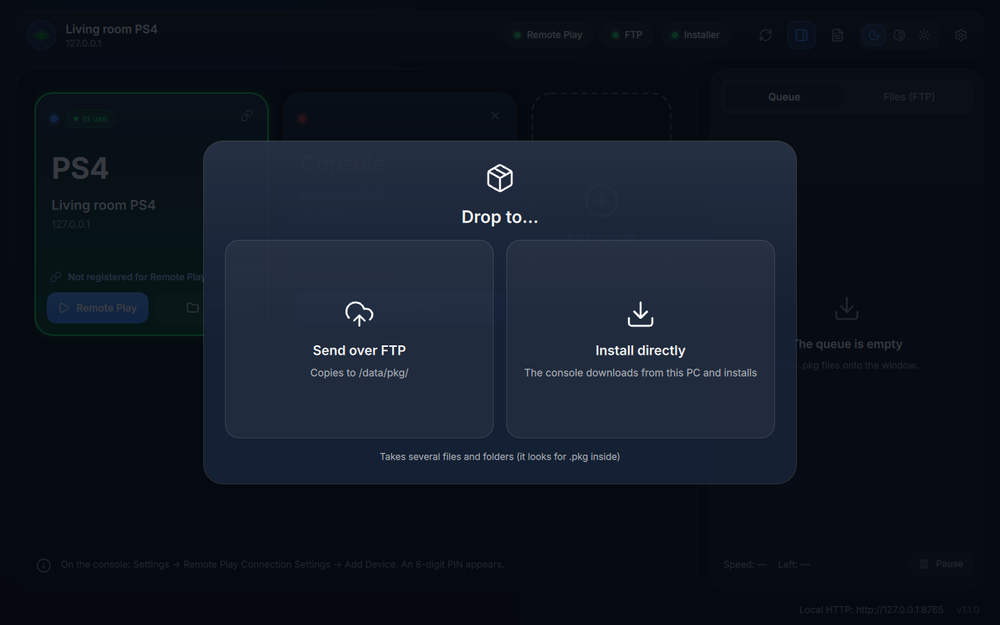
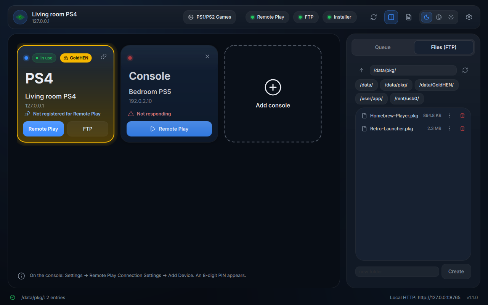
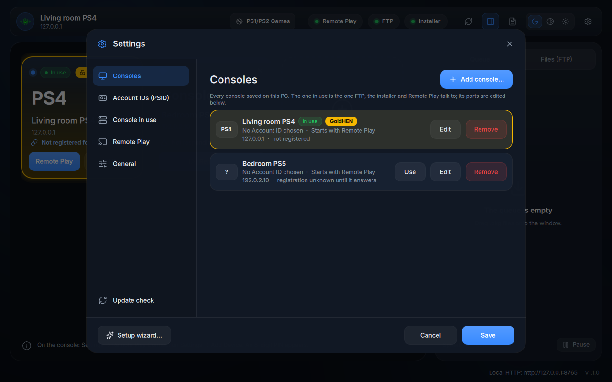
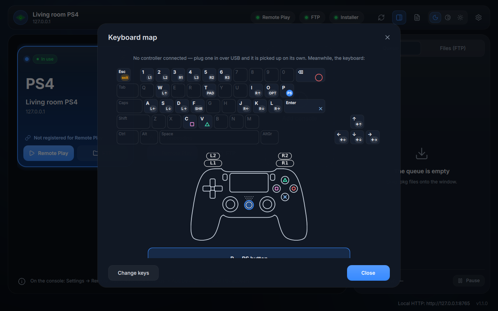
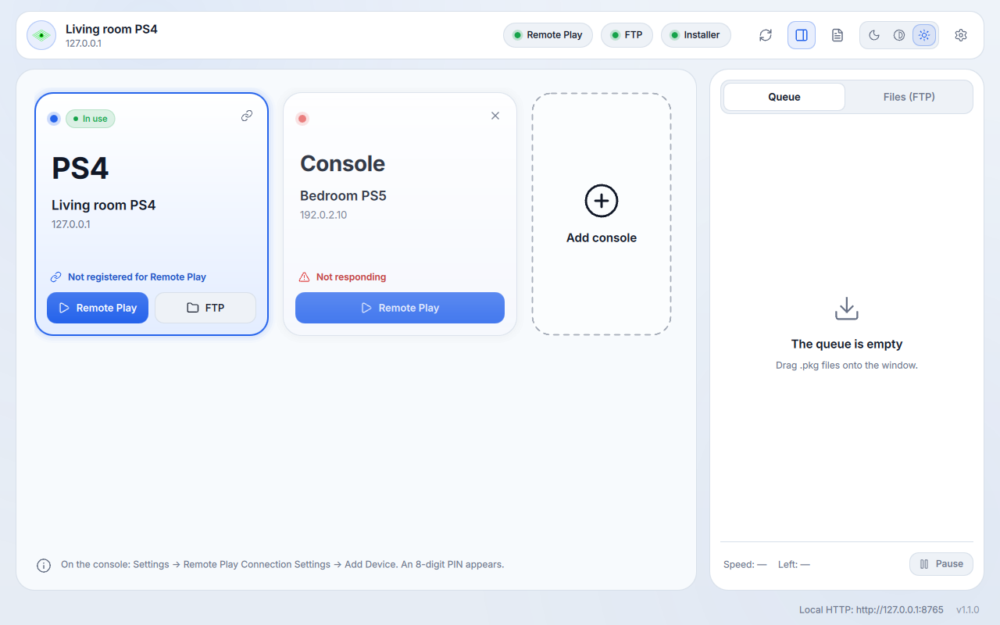
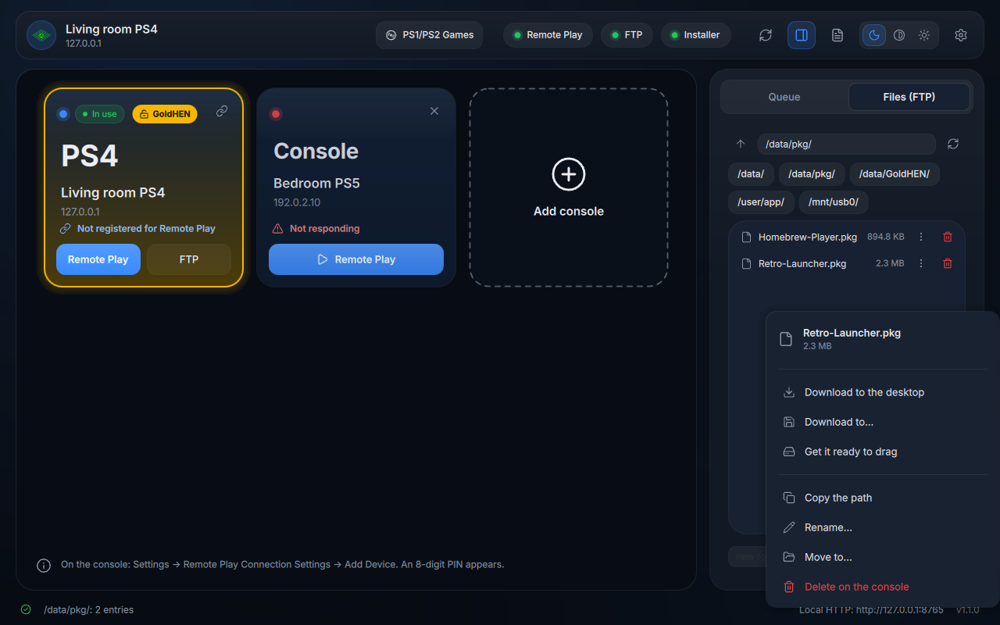

# OrbisLink

I created this repo to make a jailbroken PS4 easier to use: a mix of Remote Play and FileZilla. Thanks to everyone who shared their code online — this repo exists because of you. Special thanks to CHIAKI and to all the devs who helped build the jailbreak. The app was built ENTIRELY by CLAUDE on the PRO plan. Use it, change it, have fun :p

A desktop app that brings together, in one window, **Remote Play** for a PS4
or PS5, **installing .pkg files by drag and drop**, and an **FTP client** for
the console.

> **Status:** Remote Play works on real PS4 and PS5 consoles (discovery,
> registration, waking from rest mode, 1080p/60 video, sound, microphone,
> controller and keyboard). Installing pkg files and FTP need a PS4 with
> GoldHEN, or a PS5 with a jailbreak that provides them (etaHEN). The app is
> in English, with a Portuguese translation. See
> [What is missing](#what-is-missing-and-why).

## The interface



*The middle of the window is Remote Play. Each console (PS4 or PS5) has its
own box with its state. One click connects: the app checks the console,
wakes it if it is in rest mode, waits until it is ready and connects — or
opens the registration if this PC is not registered on it yet. The dashed box
adds another console, by scanning the network or by IP.*



*Direct install in progress: the PC serves the pkg, the console downloads it
with `Range` requests and installs it. Game → patch → DLC go in the right
order automatically.*

| Drag and drop | FTP browser | Settings |
|---|---|---|
|  |  |  |

| Keyboard map | Light theme |
|---|---|
|  |  |

*With no controller connected, the keyboard acts as one. Every key can be
changed on the map, and the change is saved.*



*In the FTP browser, every file and folder has its own menu: download to the
PC, prepare for dragging out of the window, copy the path, rename, delete on
the console. In the settings, the IP address is checked as you type.*

All these screenshots are generated automatically by
`./scripts/screenshots.sh`, against the mock console — what they show is the
real behaviour, not mock-ups.

## Intended use

For the user's own consoles, for homebrew and copies of games the user
legally owns. **The app does not include, download, index or suggest sources
of content**, and it does not run a jailbreak or load payloads: the console
must already be running GoldHEN (PS4) or a jailbreak such as etaHEN (PS5).

## What the console needs

| Service | Port | How to turn it on |
|---|---|---|
| Remote Play | 987/UDP (PS4), 9302/UDP (PS5), 9295/TCP, 9296–9297/UDP | enable it in the console settings and register the PC |
| PS4 — GoldHEN FTP server | 2121 | comes with GoldHEN, on by default |
| PS4 — Remote Package Installer (flatz) | 12800 | install it and **keep the app open and in the foreground** while commands are sent |
| PS5 — etaHEN FTP server | 1337 | `FTP=1` in etaHEN's `config.ini` |
| PS5 — etaHEN DPI v2 installer | 12800 | `DPI_v2=1` in etaHEN's `config.ini` |

The PS5 FTP port has its own setting, because it differs from the PS4's:
with a PS5 in use, the settings show and edit the PS5 port. Installing on a
PS5 through DPI v2 uses the same API as on the PS4; it has not been
confirmed on a real PS5 yet.

### Registering Remote Play

On a **PS4**: Settings → Remote Play Connection Settings → Add Device.
On a **PS5**: Settings → System → Remote Play → Link Device, signed in with
the account you will use.

The console shows an 8-digit PIN. Clicking the console's box in OrbisLink
opens the registration, which asks for the PIN and the PSN **Account ID** —
a 64-bit number, not the user name. The field accepts it in decimal,
hexadecimal or base64 and shows the three forms side by side. If the console
rejects it, the app says why (for example, "the console did not recognise
the Account ID").

> **The byte order matters.** Remote Play expects the 8 bytes of the Account
> ID from the least to the most significant. Converting the decimal number
> from PlayStation's site into hexadecimal and then base64 with a generic
> converter produces the reverse order. Paste the decimal number straight
> into the field and the app converts it correctly; or use the "The bytes
> are in the opposite order" switch. Each console keeps its own Account ID.

### Managing consoles

Settings → **Consoles** lists every console saved on this PC. From there you
can switch to one, rename it or change its IP, remove it, add a new one, and
forget this PC's Remote Play registration on it (the next connection then asks
for a new PIN). Registrations left behind by consoles no longer in the list
appear at the end, so they can be forgotten too.

Settings → **Account IDs (PSID)** keeps the PSN Account IDs saved on this PC,
each under a username so they are easy to tell apart. They can be added,
edited and removed there, and each console picks the one it registers with
(Consoles → Edit → Account ID). The registration dialog can also fill the
field from a saved one.

## Download (pre-built)

The binaries are produced by GitHub Actions
([the "Release" workflow](.github/workflows/release.yml)):

* **Windows x64** — `OrbisLink-<version>-setup.exe` (installer) or
  `OrbisLink-<version>-windows-x64.zip` (portable).
* **Linux x86-64** — `orbislink-<version>-linux-x86_64.tar.gz` (command line).

There are two kinds of release:

* **Stable** — `vX.Y.Z`, published on purpose from `main`
  (**Actions → Release → Run workflow** on `main`, with the version). It is
  what the repository page shows as the latest release.
* **Test builds** — `vX.Y.Z-dev.N`, published automatically on **every push**
  to the `beta` branch, as pre-releases (or by hand, with **Run workflow** and
  an empty version). Only the five most recent are kept.

There are two branches: `main` is the official one, and stable releases come
from it; `beta` is where changes land first, and they move to `main` once
tested.

The app updates itself from here: in **Settings → Updates**, the **Stable**
channel only sees final releases; the **Testing (branch builds)** channel
also sees every test build, and installs it in one click (with the SHA-256
checked before the installer runs).

The Windows installer puts the program in `C:\Program Files\OrbisLink`,
creates Start Menu shortcuts, registers the uninstaller and — if you leave
the option on — **creates the firewall rule** that lets the console download
pkg files from the PC (without it, installs stay at 0 bytes).

## Building

Dependencies: CMake ≥ 3.16, a C++17 compiler (GCC, Clang or MSVC) and
libcurl.

```bash
# Debian/Ubuntu
sudo apt install cmake build-essential libcurl4-openssl-dev

cmake -S . -B build -DCMAKE_BUILD_TYPE=RelWithDebInfo
cmake --build build
ctest --test-dir build --output-on-failure
```

On Windows, with vcpkg:

```powershell
cmake -S . -B build -DCMAKE_TOOLCHAIN_FILE=<vcpkg>/scripts/buildsystems/vcpkg.cmake
cmake --build build --config RelWithDebInfo
```

### Building the packages

```bash
./scripts/build-linux.sh      # builds, runs the tests and makes the .tar.gz

sudo apt install mingw-w64 nsis zip
./scripts/build-windows.sh    # standalone .exe + portable .zip + installer
```

`build-windows.sh` builds from Linux with mingw-w64: it builds a static
libcurl (TLS through Windows' Schannel, no OpenSSL) and links everything
statically.

## Trying it without a console

`tools/mock-console/` has a fake console: an anonymous FTP server and the
installer API on 12800, which really downloads the pkg files from the local
HTTP server with `Range` requests, just like the console does.

```bash
# terminal 1
python3 tools/mock-console/mock_console.py --ftp-port 2121 --api-port 12800

# terminal 2
python3 tools/mock-console/make_test_pkg.py /tmp/game.pkg --padding 4000000
./build/orbislink-cli inspect /tmp/game.pkg
./build/orbislink-cli services --host 127.0.0.1
./build/orbislink-cli install --host 127.0.0.1 --bind 127.0.0.1 /tmp/game.pkg
./build/orbislink-cli ftp-ls --host 127.0.0.1 /data/pkg
```

The same run happens automatically in `ctest -R integration_mock_console`.

## With a real console

```bash
./build/orbislink-cli services --host 192.168.1.42
./build/orbislink-cli install  --host 192.168.1.42 "/path/Game.pkg" "/path/Patch.pkg"
./build/orbislink-cli ftp-put  --host 192.168.1.42 "/path/Game.pkg" /data/pkg/Game.pkg
```

The local HTTP server binds by default to the interface whose subnet contains
the console's IP and only accepts requests from that IP. The first time on
Windows, the firewall asks for permission — it must be granted, or the
console cannot download from the PC.

`orbislink-cli --help` lists every command.

## Layout

```
src/orbislink/
  common/     tolerant JSON, rotating log, utilities
  net/        sockets, HTTP client (libcurl), local interface choice
  pkg/        PkgInspector, PARAM.SFO parser
  http/       LocalHttpServer (Range/206, tokens, IP restriction)
  installer/  IInstallerBackend, RpiClient, error code descriptions
  ftp/        FtpClient (libcurl)
  queue/      InstallQueue with persistence
  settings/   SettingsStore
  console/    ConsoleManager (service checks)
  stream/     Remote Play on top of chiaki-ng: discovery, registration, session
  qt/         the Qt Quick interface's controllers
qml/                  the interface
tools/cli/            orbislink-cli
tools/mock-console/   fake console + test pkg generator
tests/                unit and integration tests
docs/                 specification, validation, errors, architecture, status
packaging/windows/    installer script (NSIS) and the README that goes inside
scripts/              build, screenshot and check scripts
cmake/                cross-compilation toolchain for mingw-w64
translations/         Portuguese translation (the source language is English)
```

## Documentation

* [`docs/specification.md`](docs/specification.md) — the specification, with
  the **[VALIDATE]** points resolved.
* [`docs/validation.md`](docs/validation.md) — what was confirmed, where, and
  how it differs from the original specification.
* [`docs/error_codes.md`](docs/error_codes.md) — console error codes and the
  ones still without a source.
* [`docs/architecture.md`](docs/architecture.md) — modules, threads and flows.
* [`docs/status.md`](docs/status.md) — what is done and what is missing,
  item by item.

## If something does not work

**Drag and drop does nothing and the cursor shows the "forbidden" sign.**
The app is running as administrator. Windows does not let you drag files
from Explorer — which runs without elevated privileges — onto a window that
has them, and it blocks the messages without telling anyone. Close it and
open it from the normal shortcut; OrbisLink does not need privileges for
anything.

**Remote Play connects but there is no sound.** Export the diagnostics
(Ctrl+L → "Save report"). The *Remote Play — sound path* section shows the
nine stages between the decoder and the sound card, with their counters, and
says at which one the flow drops to zero.

**I chose 1080p and the picture did not change.** Only the PS4 Pro and the
PS5 do 1080p over Remote Play. On a regular PS4 the console itself lowers the
request to 720p — the app says so when it happens, and the stream bar shows
the real picture size and the measured fps.

**The console rejects the registration.** The app says the console's reason.
"Did not recognise the Account ID" usually means the wrong account, or the
bytes in the wrong order (see [Registering Remote Play](#registering-remote-play)).

**The window does not open at all.** See `IF THE WINDOW DOES NOT OPEN` in the
`README.txt` that comes with the installer: on machines without graphics
acceleration, the next start switches to software rendering by itself.

In every case, the diagnostics (Ctrl+L) say what happened. They do not
include the Account ID or the registration keys — only their lengths.

## What is missing, and why

The full list, checked against the code, is in
[`docs/status.md`](docs/status.md). In short:

**Remote Play over PSN.** Local network only. Connecting from outside needs
Sony's *holepunch* infrastructure, which chiaki-ng supports but which needs
an account and an authentication path this project does not have yet.

**Installing on a PS5.** It uses etaHEN's DPI v2, which speaks the same API
as the PS4 installer; it still has to be confirmed on a real PS5.

**Real blur behind the glass.** The visual language is built from stacked
translucent layers. Real blur needs `QtQuick.Effects` (Qt 6.5+), and the
screenshots are built with 6.4.

**AppImage for Linux.** There is the `.tar.gz` with the command line; the
graphical interface is only distributed for Windows.

**Code signing.** The installer is not signed, so Windows shows the
SmartScreen warning on the first run. A code-signing certificate costs a few
hundred euros a year, which is not justified for a project that is not sold.

### Manual test checklist on real consoles

- [x] Remote Play discovery and registration (PS4 and PS5)
- [x] Microphone in a PS5 party
- [ ] Waking a PS5 from rest mode with one click
- [ ] Stable stream during a 10 GB+ FTP upload
- [ ] Direct install of a small homebrew
- [ ] Direct install of a pkg > 4 GB
- [ ] Game + patch + DLC dropped together (order gd → gp → ac)
- [ ] Network drop halfway and resume
- [ ] Windows firewall blocking → correct message
- [ ] FTP upload resume with `REST`/`APPE` (to be confirmed, see `docs/validation.md` §9)
- [ ] FTP and install on a PS5 with etaHEN

## Licence

**AGPL-3.0-or-later** (see [`LICENSE`](LICENSE)).

    Copyright (C) 2026 the OrbisLink authors

Remote Play comes from chiaki-ng, which is AGPL-3.0, and that licence is
contagious: if the app is distributed, the source code has to be too. That
is why this repository exists.

The copyright notices of chiaki-ng and the other libraries stay where they
are — they belong to other people and the licence requires keeping them.

The PS4/PS5 wordmarks on the console box are set in
[Fugaz One](https://fonts.google.com/specimen/Fugaz+One), by LatinoType,
under the SIL Open Font License 1.1 (see [`third-party/fugaz-one`](third-party/fugaz-one)).

Sources consulted to implement the protocols:
[chiaki-ng](https://github.com/streetpea/chiaki-ng),
[Remote Package Installer](https://github.com/flatz/ps4_remote_pkg_installer),
[GoldHEN](https://github.com/GoldHEN/GoldHEN),
[etaHEN](https://github.com/etaHEN/etaHEN) and the
[OpenOrbis PS4 Toolchain](https://github.com/OpenOrbis/OpenOrbis-PS4-Toolchain).
